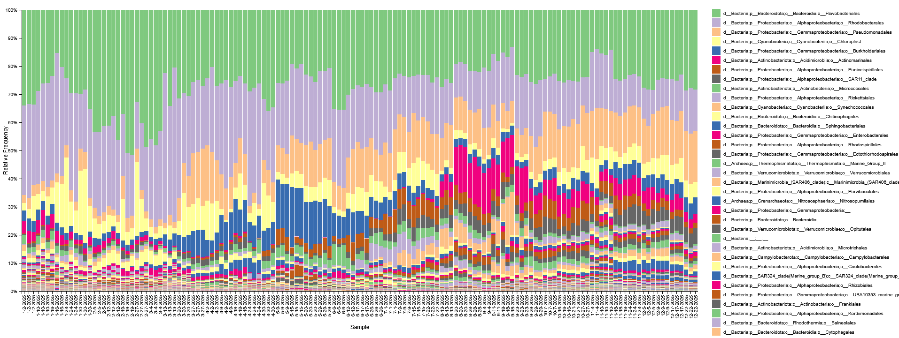
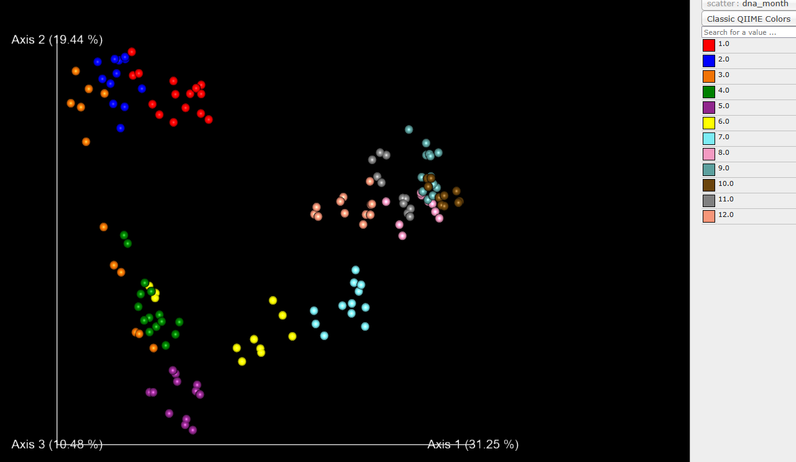
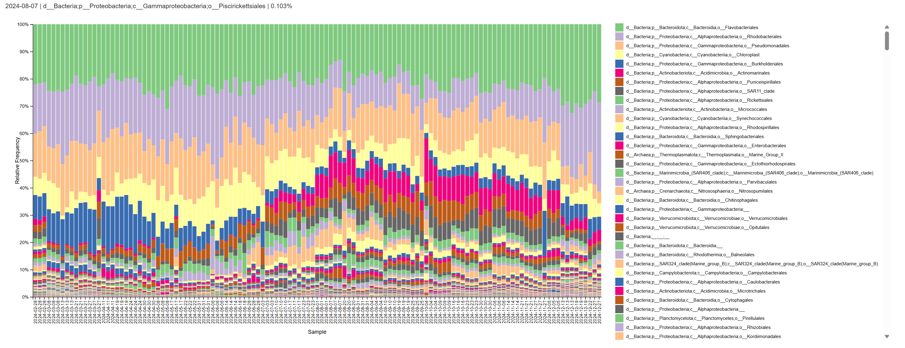
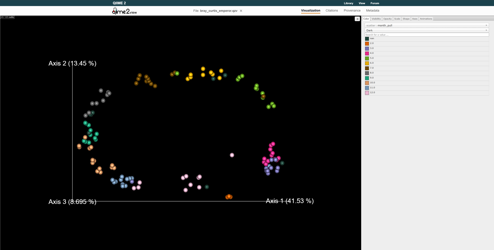
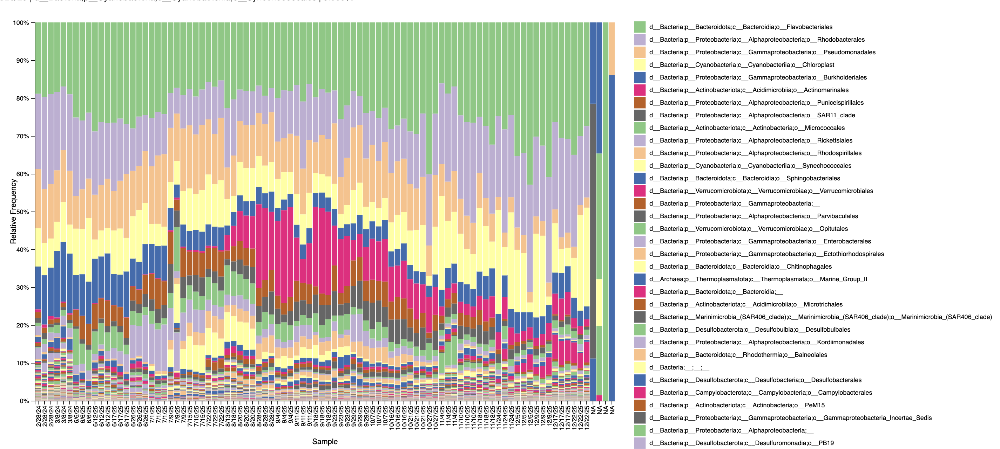
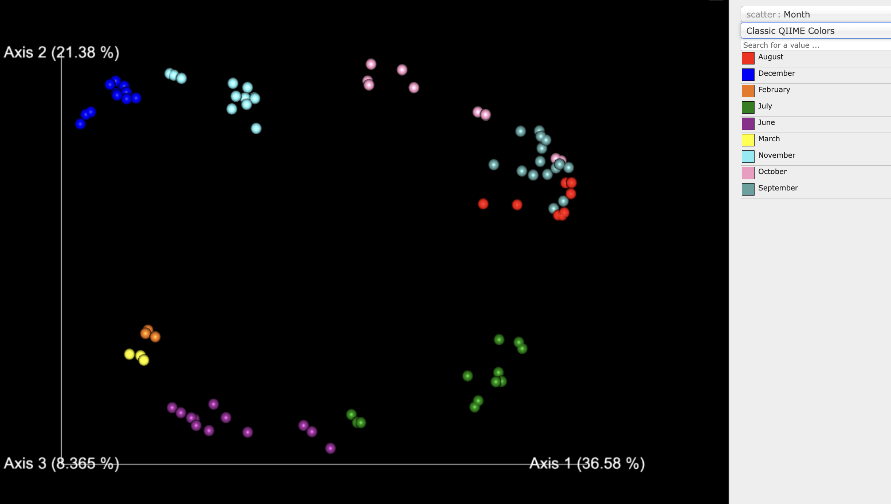

README

**Project Name**: Bioinformatic analysis for spatial and temporal trends of 16S data from weekly water samples taken in Great Bay Estuary, New Hampshire

**Authors**: Sara Smith, Marley Gonsalves, Natalie Danek, Elijah St. Pierre

**Background**

Aquatic habitats, including rivers, estuaries, and coasts, are habitats that offer ecological and economic services such as habitat for fish and shellfish, water filtration, nutrient cycling, and recreation. Many of these cycles and processes associated with these services are facilitated by microbes, such as bacteria and archaea (Crump and Bowen, 2024). Microbes are highly diverse, and their community composition and structure may change rapidly due to temperature, nutrient availability, competition, or other pressures (Pannard, 2008), which means that repeated sampling is necessary to fully capture their trends. This is especially apparent in dynamic systems with flowing water, where environmental parameters are constantly changing. This study aims to characterize the microbial community composition in a variety of habitats, ranging from freshwater to brackish to marine, near the New Hampshire coast, supplementing existing monitoring within the area. This information will be used to inform aquaculture practices, track potentially hazardous taxa (such as those associated with harmful algal blooms or antibiotic resistance), and provide a baseline for future change in a changing climate.  

**Methods**

Water samples were collected weekly from 3 sites and monthly from 4 sites, all within the Great Bay Watershed in New Hampshire. The weekly sites included the Coastal Marine Lab (CML) in New Castle, NH, the Jackson Estuarine Lab (JEL) in Durham, NH and Wiswall Mill (WIS) in Durham, NH. The monthly sites included Hilton Park (HILT) in Dover, NH, Miriam Jackson Park off Main Street (MAIN) in Epping, NH, the Lamprey River Boat Launch (LAMP) in Epping, NH and Newmarket Boat Launch (NBL) in Newmarket, NH. Back at the lab, 500 mL of water from each sample was filtered in triplicate through 0.2 um 47 mm Cytiva filters using Thermo Scientific Nalgene Reusable Filter Units. The filters were stored in –80 C until extraction.  

DNA was extracted with ZymoBIOMICS DNA miniprep kits with bead beating. DNA concentration was measured using Qubit™ 1X dsDNA HS (High Sensitivity) Assay Kits. 16S PCR was conducted using 16S-V4 primer pair: forward (515F): GTGCCAGCMGCCGCGGTAA, and reverse (806R): GGACTACHVGGGTWTCTAAT (Kozich et al., 2013). The PCR amplification profile was 2 minutes at 95 °C, 30 cycles of 20 seconds at 95 °C, 30 seconds at 50 °C, 1 minute at 72 °C, then followed by 72 °C for 5 minutes, and then held at 4 °C. Following PCR, 5 µL of product was run on an electrophoresis gel, with a 100 bp ladder and a negative control to check for contamination. Sample concentrations were standardized when needed by dilution of Nuclease Free Water to 10 ng µL-1. 30 µL per sample was sent to Michigan State University (MSU) in two 96 well PCR-type plates for paired-end 16S AVITI sequencing.   

Two sequences of Demultiplexed 16S fastq files from MSU were transferred to Ron using Filezilla, then split amongst group members for analysis (Table 1). Each dataset was analyzed in the same way, using the following procedure. 

| Group Member | Data Set | Sequence 1 Forward/Reverse Cut | Sequence 2 Forward/Reverse Cut | Rarefaction | 
| -------- | -------- | -------- | -------- | -------- | 
| Sara Smith | CML 2025| 240/200 | 240/200 | 64548 | 
| Elijah St. Pierre | CML 2024  | 190/210 | N/A | 71059 | 
| Marley Gonsalves    | JEL February to December 2025  | 240/200 | 240/200 | 64548 | 
| Natalie Danek   | WIS, MAIN, LAMP, and NBL September to December 2025 | 240/200 | 240/240 | 36486 | 

*Table 1. Data set distribution and unique variables used for analysis.*

Metadata files were generated in Excel; the first column of the metadata files contained the IDs of each sample in the respective dataset, and the following columns included site, date of sample collection, and related environmental parameters (e.g. chlorophyll a concentration, and picoeukaryote/nanoeukaryote/cyanobacteria cell counts). Metadata files were saved as .txt files and loaded into Ron. QIIME 2 (qiime2-amplicon-2026.1) was used in a Conda environment, and cutadapt was used to remove the primers (Bolyen et al., 2019; Martin, 2011). A manifest file was created and used to import the fastq files into QIIME 2 with QIIME tools import. The data was then summarized into a .qzv file and visualized with the QIIME2 View (https://view.qiime2.org/) to create quality score plots. Forward and reverse reads were cut where the quality score fell below 30 (Table 1). A feature table summary was generated, and a feature table was used to map IDs to sequences. Data was denoised using dada2 (Callahan et al., 2016). At this point, for the group members whose data was split into two separate runs (Sara, Marley and Natalie), these methods were repeated for the second run. Then, the two outputs were merged. A new “merged” directory was created and the feature tables and rep-seqs from each run were copied into this new directory. Qiime feature-table merge was used to merge the two feature tables and qiime feature-table merge-seqs was used to merge the two rep-seq files (Bolyn et al., 2019). A summary .qzv file was made using the merged files and the metadata file with qiime feature-table summarize (Bolyen et al., 2019). Then, whether merging was required or not, the SILVA database (silva-138-99-nb-classifier) was used to assign taxonomy (Chuvochina et al., 2026). Rooted phylogeny trees were created for each site, and summary tables were visualized to determine rarefaction value (Katoh et al. 2002; Price et al. 2010).  Depth was based on 100% sample retention while still allowing for sufficient diversity (Table 1). Samples below depth were dropped from analysis. All metrics, including the weighted UniFrac, Bray‐Curtis dissimilarity, and Principle Coordinate Analysis (PCoA) were estimated after samples were rarefied using qiime diversity core-metrics-phylogenetic (Bolyen et al., 2019; Lozupone et al. 2007; Bray et al. 1957). 

**Findings**

*Sara - CML 2025 results*

Figure 1. Level 4 taxa barplot of the Coastal Marine Lab 2025 microbial community made through a Visual Studio Code Qiime 2 conda environment, visualized with Qiime 2 View (Bolyen et al., 2019). 

Though many taxa were present year-round, strong seasonality impacting relative abundance was witnessed. Flavobacteriales (light green; most frequent genus: NS5 Marine Group) and Rhodobacteriles (light purple; most frequent genus: Planktomarina) were consistently the dominant, with relative frequency ranging from 15.329%-51.629% and 11.750%-42.775% respectively. Both were largely dominant in the late winter to early spring period (January – April). Flavobacteriales had the highest frequencies in February and early March, while Rhodobacterales had the highest frequencies in March (>50% of sample).  Chloroplast (yellow) also saw a brief high relative frequency (1/21/25: 26.867%) in winter, but it was short lived, with overall frequency between 1-11%.  In contrast, Psueudomonadales (orange) had low relative frequency in the winter months (~2-7%), but in late March began to represent a large portion of the community (10-20%).  This frequency range persisted throughout the rest of the year.  Burkholderiales (dark blue) made up between 3-5% for most of the year, but began to grow in relative frequency starting in March, reaching a max in April (5/15/2025: 21.362%) before returning to prior abundance. Actinomarinales (dark purple) was seen at low values at the beginning of the year, and dropped below 1% between the end of April to the beginning of August. However, from August to the end of September, frequency spiked (8/20/2025: 17%) and remained in the double digits until October.  A variation of this trend was seen in Puniceispirillales (brown), which was absent from January to mid-March, but slowly increased throughout March – November, maxing in June (7/15/2025: 7.804), then maintaining 5-7% relative frequency until December.   

Figure 2. Bray Curtis PCOA of the Coastal Marine Lab 2025 microbial community made through a Visual Studio Code Qiime 2 conda environment using qiime diversity core-metrics-phylogenetic and visualized with Qiime 2 View. 

The Bray Curtis PCOA showed clear clustering of samples by monthly time points, indicating strong seasonality within the CML environment and reinforcing conclusion from the taxa barplot. March samples fell within both winter (January to March) and Spring (April/May) clusters, while August showed more similarity to the fall and early winter months than the summer. 

*Natalie - HILT, LAMP, MAIN, NBL, WIS results* 

Figure 3. Taxonomic bar plot made with QIIME2 View of the relative frequency at level 4 (Class) of the HILT, LAMP, MAIN, NBL sites, which were sampled monthly from September to December in 2025, and the WIS site which was sampled weekly during that time period (Bolyen et al., 2019). 

In this plot, on the x asis is the site_date and on the y axis is the relative frequency of the different assigned taxa on the class level. The two sites with the most saltwater input and that experience tidal changes, HILT and NBL, are very similar to each other. The other 3 sites, LAMP, MAIN, and WIS, which are much farther from saltwater sources and do not experience tidal changes, have a lot of similarities to one another. HILT and NBL have a lot more of Flavobacteriales (tan, 17-28%), Pseudomonadales (dark blue, 8- 16%) and Rhodobacterales (pink, 7-20%) compared to the other sites. The other sites, LAMP, MAIN, and WIS all have the highest frequency of Burkholderiales (green, 22-60%) and second highest frequency of Frankiales (purple, 3-28%). HILT and NBL have significantly smaller amounts of Burkholderiales (green, 3-9%). NBL has a small frequency of  Frankiales (purple, 4-5%) and HILT, which is the most salty of these sites, has none. This graph therefore demonstrates a clear influence of saltwater input on taxonomic frequencies, leading to site differences throughout this watershed. 

Figure 4. Weighted unifrac PCOA plot by site of HILT, LAMP, MAIN, NBL, and WIS sites made with QIIME2 View (Bolyen et al., 2019, Callahan et al., 2016, Halko et al., 2011, Hamady et all., 2010, Katoh and Standley, 2013, Lane,1991, Legendre and Legendre, 2012, Lozupone and Knight, 2005, Lozupone et al., 2011, Martin, 2011, McDonald et al., 2012a, McDonald et al., 2012b, McDonald et al., 2012c, McDonald et al., 2018,  Price et al., 2010, Vázquez-Baeza et al., 2017, Vázquez-Baeza et al., 2013, Weiss et all, 2017, Wes and McKinney, 2010). 

This is a weighted unifrac PCOA plot of the microbial communities at the HILT, LAMP, MAIN, NBL, and WIS sites, colored by site. There is grouping happening by site. HILT appears to be the most different from the other sites, especially from LAMP, MAIN, and WIS. This makes sense as HILT is a much more tidal and salty site compared to the others. NBL is split between the two groups, which makes sense because it has some tidal flux but not as much as HILT. The three freshwater, non tidal sites, LAMP, MAIN and WIS, are very grouped together, indicating similar microbial community makeup. These findings are very similar to the trends seen in the taxonomic barplot (Figure 3). 

*EJ CML 2024*

Figure 5: Taxonomic bar plot made using developed bioinformatic pipeline and displayed using QIIME 2 View. Plot displays relative frequency (level 4) of the Coastal Marine Lab sample site from February 2024 till December 2024.  

Visual distribution of Flavobacteria remains relatively stable across 2024, with only a 5-10% change in distribution for most of 2024, with the vast majority staying between 18-23%. May 8th is an exception to this, peaking at 31% for Flavobacteria. Rhodobacterales displayed similar stability for 2024 with a slight seasonal shift starting in July, decreasing its frequency through December. Pseudomonadales remained stable for most of the year, rarely going above 20% frequency or below 10%. There is a visual seasonal trend with lower distributions during the July-December timeframe, much like Rhodobacterales. Cyanbacterial chloroplast DNA was present year-round with a sharp decrease in frequency August through December. The most visual striking transition was from Burkholderiales dominance during the February through June timeline, with a shift to Actinomarinales dominance for the remainder for the year. This timeline was similarly reflected, albeit on a smaller scale, with a transition to Rhodospiralles and Synechoccocales during the late June to December timeframe.  

Figure 6: Bray curtis PCOA distribution made with QIIME 2 View highlighted by Month (2.0-12.0, Feb-Dec 2026).  

Figure 6  demonstrates the seasonal distribution of bacteria by Month. It’s clear there are some stronger seasonal variations highly concentrated, such as May in lime green (2.0, top right). We also see clustering for October (10.0, bottom left, orange) on the opposite corner. Notably, the distribution of months follows a sequential counterclockwise pattern from February starting bottom right in Orange.  

*Marley - JEL*

Figure 7. Taxonomic bar plot made with QIIME2 View of the relative frequency at level 4 (Order) for weekly samples collected from JEL (June to December 2025) (Bolyen et al., 2019).

Like in other sites, prokaryotic communities at JEL exhibited temporal trends. Through three orders were dominant throughout the sampling period, accounting for around 40-70% of ASVs identified, there was variation in both relative frequencies of these abundant taxa, and in the composition of the rest of the community. The three most abundant orders were Flavobacteriales (15 – 40%), Rhodobacterales (6 – 28%), and Pseudomonadales (2 – 19%). Of these, Pseudomonadales showed the most obvious seasonal trend, decreasing in abundance in November and December. Burkholderiales also showed a seasonal trend, with higher relative abundances in June (12 – 17%), decreasing to 3 – 5% relative abundance for the rest of the year. Another distinct seasonal pattern is the appareance of Actinomarinales in August. While present some earlier weeks at very low abundances (< 1%), this order became quite abundant from August to October, making up 25% of the community at its peak. Though its abundance went down to around 2 – 5% in November and December, Actinomarinales remained visible for the rest of the time period. Lastly, Synechococcales exhibited a spike in abundance in July and August (7 – 10%). This cyanobacterial order may have responded to a spike in temperature at this time, though further data would be necessary to make a conclusion. Overall, bacteria and archaea community composition exhibits seasonal trends at JEL, even over a short time frame of six months. Further monitoring efforts will help elucidate these trends over a full year, and help provide insight into ecological impacts. 

Figure 8. Bray-Cutris PCoA plot by date of JEL samples with QIIME2 View (Bolyen et al., 2019, Callahan et al., 2016, Halko et al., 2011, Hamady et all., 2010, Katoh and Standley, 2013, Lane,1991, Legendre and Legendre, 2012, Lozupone and Knight, 2005, Lozupone et al., 2011, Martin, 2011, McDonald et al., 2012a, McDonald et al., 2012b, McDonald et al., 2012c, McDonald et al., 2018,  Price et al., 2010, Vázquez-Baeza et al., 2017, Vázquez-Baeza et al., 2013, Weiss et all, 2017, Wes and McKinney, 2010).

This figure shows clear seasonality in prokaryotic community composition at JEL. In some cases, time frames are more clustered and distinct, while in other cases there is more overlap between months. For instance, samples from there is overlap between samples from August, September, and October, while samples from November and December are more distinct. Changes in the community seem tied to season, since sequential months are closer together on the PCoA than months that are further apart. However, change in the community does not seem to be tied directly to date. There is considerable change in the community from the beginning of June to the end of July, for example, while there is less change in the community from the beginning of August to the end of September. This suggests that something other than time is structuring the community, though these other pressures are likely related to season. There also seems to be distinction between samples from June/July and August – December. Interestingly, the communities from August are quite different from those in July, despite the fact that conditions like temperature are similar in July and August. This further supports the idea that unknown environmental factors are driving the community, and that there are likely multiple factors impacting community structure concurrently. 

**Citations**

Bolyen, E., Rideout, J. R., Dillon, M. R., Bokulich, N. A., Abnet, C. C., Al-Ghalith, G. A., Alexander, H., Alm, E. J., Arumugam, M., Asnicar, F., Bai, Y., Bisanz, J. E., Bittinger, K., Brejnrod, A., Brislawn, C. J., Brown, C. T., Callahan, B. J., Caraballo-Rodríguez, A. M., Chase, J., … Caporaso, J. G. (2019). Reproducible, interactive, scalable and extensible microbiome data science using QIIME 2. Nature Biotechnology, 37(8), 852–857. 10.1038/s41587-019-0209-9 

Bray, J.R. and Curtis, J.T. (1957), An Ordination of the Upland Forest Communities of Southern Wisconsin. Ecological Monographs, 27: 325-349. https://doi.org/10.2307/1942268 

Callahan, B.J., McMurdie, P.J., Rosen, M.J., Han, A.W., Johnson, A.J.A., and Holmes, S.P. (2016). DADA2: High-resolution sample inference from Illumina amplicon data. Nature Methods, 13(7), 581-583. doi: 10.1038/nmeth.3869 

Chuvochina M, Gerken J, Frentrup M, Sandikci Y, Goldmann R, Freese HM, Göker M, Sikorski J, Yarza P, Quast C, Peplies J, Glöckner FO, Reimer LC (2026) SILVA in 2026: a global core biodata resource for rRNA within the DSMZ digital diversity. Nucleic Acids Research, gkaf1247. 

Crump, B. C., & Bowen, J. L. (2024). The Microbial Ecology of Estuarine Ecosystems. Annual Review of Marine Science, 16(1), 335–360. https://doi.org/10.1146/annurev-marine-022123-101845 

Halko, N., Martinsson, P.-G., Shkolnisky, Y., & Tygert, M. (2011). An Algorithm for the Principal Component Analysis of Large Data Sets. SIAM Journal on Scientific Computing. https://doi.org/10.1137/100804139 

Hamady, M., Lozupone, C., & Knight, R. (2010). Fast UniFrac: facilitating high-throughput phylogenetic analyses of microbial communities including analysis of pyrosequencing and PhyloChip data. The ISME Journal, 4(1), 17–27. https://doi.org/10.1038/ismej.2009.97 

Katoh, K., & Standley, D. M. (2013). MAFFT multiple sequence alignment software version 7: improvements in performance and usability. Molecular Biology and Evolution, 30(4), 772–780. https://doi.org/10.1093/molbev/mst010 

Katoh K, Misawa K, Kuma K, et al. MAFFT: a novel method for rapid multiple sequence alignment based on fast Fourier transform. Nucleic Acids Res. 2002;30:3059‐3066. 

Lane, D. (1991). 16S/23S rRNA sequencing. In E. Stackebrandt & M. Goodfellow (Eds.), Nucleic Acid Techniques in Bacterial Systematics (pp. 115–175). John Wiley. 

Legendre, P., & Legendre, L. (2012). Numerical Ecology (Third, p. 499). Elsevier. 

Lozupone, C. A., Hamady, M., Kelley, S. T., & Knight, R. (2007). Quantitative and Qualitative β Diversity Measures Lead to Different Insights into Factors That Structure Microbial Communities. Applied and Environmental Microbiology, 73(5), 1576–1585. https://doi.org/10.1128/AEM.01996-06 

Lozupone, C., & Knight, R. (2005). UniFrac: a New Phylogenetic Method for Comparing Microbial Communities. Applied and Environmental Microbiology, 71(12), 8228–8235. https://doi.org/10.1128/AEM.71.12.8228-8235.2005 

Lozupone, C., Lladser, M. E., Knights, D., Stombaugh, J., & Knight, R. (2011). UniFrac: an effective distance metric for microbial community comparison. The ISME Journal, 5(2), 169–172. https://doi.org/10.1038/ismej.2010.133 

Martin, M. (2011). Cutadapt removes adapter sequences from high-throughput sequencing reads. EMBnet. Journal, 17(1), pp-10. https://doi.org/10.14806/ej.17.1.200 

McDonald, D., Clemente, J. C., Kuczynski, J., Rideout, J. R., Stombaugh, J., Wendel, D., Wilke, A., Huse, S., Hufnagle, J., Meyer, F., Knight, R., & Caporaso, J. G. (2012a). The Biological Observation Matrix (BIOM) format or: how I learned to stop worrying and love the ome-ome. GigaScience, 1(1), 7. https://doi.org/10.1186/2047-217X-1-7 

McDonald, D., Clemente, J. C., Kuczynski, J., Rideout, J. R., Stombaugh, J., Wendel, D., Wilke, A., Huse, S., Hufnagle, J., Meyer, F., Knight, R., & Caporaso, J. G. (2012b). The Biological Observation Matrix (BIOM) format or: how I learned to stop worrying and love the ome-ome. GigaScience, 1(1), 7. https://doi.org/10.1186/2047-217X-1-7 

McDonald, D., Clemente, J. C., Kuczynski, J., Rideout, J. R., Stombaugh, J., Wendel, D., Wilke, A., Huse, S., Hufnagle, J., Meyer, F., Knight, R., & Caporaso, J. G. (2012c). The Biological Observation Matrix (BIOM) format or: how I learned to stop worrying and love the ome-ome. GigaScience, 1(1), 7. https://doi.org/10.1186/2047-217X-1-7 

McDonald, D., Vázquez-Baeza, Y., Koslicki, D., McClelland, J., Reeve, N., Xu, Z., Gonzalez, A., & Knight, R. (2018). Striped UniFrac: enabling microbiome analysis at unprecedented scale. Nature Methods, 15(11), 847–848. https://doi.org/10.1038/s41592-018-0187-8 

Pannard, A., Claquin, P., Klein, C., Le Roy, B., & Véron, B. (2008). Short-term variability of the phytoplankton community in coastal ecosystem in response to physical and chemical conditions’ changes. Estuarine, Coastal and Shelf Science, 80(2), 212–224. https://doi.org/10.1016/j.ecss.2008.08.008 

Price, M. N., Dehal, P. S., & Arkin, A. P. (2010). FastTree 2–approximately maximum-likelihood trees for large alignments. PloS One, 5(3), e9490. https://doi.org/10.1371/journal.pone.0009490 

Vázquez-Baeza, Y., Gonzalez, A., Smarr, L., McDonald, D., Morton, J. T., Navas-Molina, J. A., & Knight, R. (2017). Bringing the dynamic microbiome to life with animations. Cell Host & Microbe, 21(1), 7–10. https://doi.org/10.1016/j.chom.2016.12.009 

Vázquez-Baeza, Y., Pirrung, M., Gonzalez, A., & Knight, R. (2013). EMPeror: a tool for visualizing high-throughput microbial community data. Gigascience, 2(1), 16. https://doi.org/10.1186/2047-217X-2-16 

Weiss, S., Xu, Z. Z., Peddada, S., Amir, A., Bittinger, K., Gonzalez, A., Lozupone, C., Zaneveld, J. R., Vázquez-Baeza, Y., Birmingham, A., Hyde, E. R., & Knight, R. (2017). Normalization and microbial differential abundance strategies depend upon data characteristics. Microbiome, 5(1), 27. https://doi.org/10.1186/s40168-017-0237-y 

Wes McKinney. (2010). Data Structures for Statistical Computing in Python . In S. van der Walt & Jarrod Millman 
(Eds.), Proceedings of the 9th Python in Science Conference (pp. 51–56). 

 *** EJ Citations BarPlot Start ***
 
Bokulich, N. A., Kaehler, B. D., Rideout, J. R., Dillon, M., Bolyen, E., Knight, R., Huttley, G. A., & Caporaso, J. G. (2018a). Optimizing taxonomic classification of marker-gene amplicon sequences with QIIME 2’s q2-feature-classifier plugin. Microbiome, 6(1), 90. https://doi.org/10.1186/s40168-018-0470-z 

Bokulich, N. A., Kaehler, B. D., Rideout, J. R., Dillon, M., Bolyen, E., Knight, R., Huttley, G. A., & Caporaso, J. G. (2018b). Optimizing taxonomic classification of marker-gene amplicon sequences with QIIME 2’s q2-feature-classifier plugin. Microbiome, 6(1), 90. https://doi.org/10.1186/s40168-018-0470-z 

Bolyen, E., Rideout, J. R., Dillon, M. R., Bokulich, N. A., Abnet, C. C., Al-Ghalith, G. A., Alexander, H., Alm, E. J., Arumugam, M., Asnicar, F., Bai, Y., Bisanz, J. E., Bittinger, K., Brejnrod, A., Brislawn, C. J., Brown, C. T., Callahan, B. J., Caraballo-Rodríguez, A. M., Chase, J., … Caporaso, J. G. (2019a). Reproducible, interactive, scalable and extensible microbiome data science using QIIME 2. Nature Biotechnology, 37(8), 852–857. https://doi.org/10.1038/s41587-019-0209-9 

Bolyen, E., Rideout, J. R., Dillon, M. R., Bokulich, N. A., Abnet, C. C., Al-Ghalith, G. A., Alexander, H., Alm, E. J., Arumugam, M., Asnicar, F., Bai, Y., Bisanz, J. E., Bittinger, K., Brejnrod, A., Brislawn, C. J., Brown, C. T., Callahan, B. J., Caraballo-Rodríguez, A. M., Chase, J., … Caporaso, J. G. (2019b). Reproducible, interactive, scalable and extensible microbiome data science using QIIME 2. Nature Biotechnology, 37(8), 852–857. https://doi.org/10.1038/s41587-019-0209-9 

Callahan, B. J., McMurdie, P. J., Rosen, M. J., Han, A. W., Johnson, A. J. A., & Holmes, S. P. (2016). DADA2: high-resolution sample inference from Illumina amplicon data. Nature Methods, 13(7), 581. https://doi.org/10.1038/nmeth.3869 

Martin, M. (2011). Cutadapt removes adapter sequences from high-throughput sequencing reads. EMBnet. Journal, 17(1), pp-10. https://doi.org/10.14806/ej.17.1.200 

McDonald, D., Clemente, J. C., Kuczynski, J., Rideout, J. R., Stombaugh, J., Wendel, D., Wilke, A., Huse, S., Hufnagle, J., Meyer, F., Knight, R., & Caporaso, J. G. (2012a). The Biological Observation Matrix (BIOM) format or: how I learned to stop worrying and love the ome-ome. GigaScience, 1(1), 7. https://doi.org/10.1186/2047-217X-1-7 

McDonald, D., Clemente, J. C., Kuczynski, J., Rideout, J. R., Stombaugh, J., Wendel, D., Wilke, A., Huse, S., Hufnagle, J., Meyer, F., Knight, R., & Caporaso, J. G. (2012b). The Biological Observation Matrix (BIOM) format or: how I learned to stop worrying and love the ome-ome. GigaScience, 1(1), 7. https://doi.org/10.1186/2047-217X-1-7 

Pedregosa, F., Varoquaux, G., Gramfort, A., Michel, V., Thirion, B., Grisel, O., Blondel, M., Prettenhofer, P., Weiss, R., Dubourg, V., Vanderplas, J., Passos, A., Cournapeau, D., Brucher, M., Perrot, M., & Duchesnay, É. (2011a). Scikit-learn: Machine learning in Python. Journal of Machine Learning Research, 12(Oct), 2825–2830. 

Pedregosa, F., Varoquaux, G., Gramfort, A., Michel, V., Thirion, B., Grisel, O., Blondel, M., Prettenhofer, P., Weiss, R., Dubourg, V., Vanderplas, J., Passos, A., Cournapeau, D., Brucher, M., Perrot, M., & Duchesnay, É. (2011b). Scikit-learn: Machine learning in Python. Journal of Machine Learning Research, 12(Oct), 2825–2830. 

Pruesse, E., Quast, C., Knittel, K., Fuchs, B. M., Ludwig, W., Peplies, J., & Glockner, F. O. (2007a). SILVA: a comprehensive online resource for quality checked and aligned ribosomal RNA sequence data compatible with ARB. Nucleic Acids Res, 35(21), 7188–7196. 

Pruesse, E., Quast, C., Knittel, K., Fuchs, B. M., Ludwig, W., Peplies, J., & Glockner, F. O. (2007b). SILVA: a comprehensive online resource for quality checked and aligned ribosomal RNA sequence data compatible with ARB. Nucleic Acids Res, 35(21), 7188–7196. 

Quast, C., Pruesse, E., Yilmaz, P., Gerken, J., Schweer, T., Yarza, P., Peplies, J., & Glockner, F. O. (2013a). The SILVA ribosomal RNA gene database project: improved data processing and web-based tools. Nucleic Acids Res, 41(Database issue), D590-6. 

Quast, C., Pruesse, E., Yilmaz, P., Gerken, J., Schweer, T., Yarza, P., Peplies, J., & Glockner, F. O. (2013b). The SILVA ribosomal RNA gene database project: improved data processing and web-based tools. Nucleic Acids Res, 41(Database issue), D590-6. 

Robeson, M. S., O\textquoterightRourke, D. R., Kaehler, B. D., Ziemski, M., Dillon, M. R., Foster, J. T., & Bokulich, N. A. (2021). RESCRIPt: Reproducible sequence taxonomy reference database management. PLoS Computational Biology. https://doi.org/10.1371/journal.pcbi.1009581 

Rognes, T., Flouri, T., Nichols, B., Quince, C., & Mahé, F. (2016). VSEARCH: a versatile open source tool for metagenomics. PeerJ, 4, e2584. https://doi.org/10.7717/peerj.2584 

Wes McKinney. (2010a). Data Structures for Statistical Computing in Python . In S. van der Walt & Jarrod Millman (Eds.), Proceedings of the 9th Python in Science Conference (pp. 51–56). 

Wes McKinney. (2010b). Data Structures for Statistical Computing in Python . In S. van der Walt & Jarrod Millman (Eds.), Proceedings of the 9th Python in Science Conference (pp. 51–56). 

Wes McKinney. (2010c). Data Structures for Statistical Computing in Python . In S. van der Walt & Jarrod Millman (Eds.), Proceedings of the 9th Python in Science Conference (pp. 51–56). 

Wes McKinney. (2010d). Data Structures for Statistical Computing in Python . In S. van der Walt & Jarrod Millman (Eds.), Proceedings of the 9th Python in Science Conference (pp. 51–56). 

*** END ***

*** EJ BRAY CURTIS CITATIONS ***

Bolyen, E., Rideout, J. R., Dillon, M. R., Bokulich, N. A., Abnet, C. C., Al-Ghalith, G. A., Alexander, H., Alm, E. J., Arumugam, M., Asnicar, F., Bai, Y., Bisanz, J. E., Bittinger, K., Brejnrod, A., Brislawn, C. J., Brown, C. T., Callahan, B. J., Caraballo-Rodríguez, A. M., Chase, J., … Caporaso, J. G. (2019). Reproducible, interactive, scalable and extensible microbiome data science using QIIME 2. Nature Biotechnology, 37(8), 852–857. https://doi.org/10.1038/s41587-019-0209-9 

Callahan, B. J., McMurdie, P. J., Rosen, M. J., Han, A. W., Johnson, A. J. A., & Holmes, S. P. (2016). DADA2: high-resolution sample inference from Illumina amplicon data. Nature Methods, 13(7), 581. https://doi.org/10.1038/nmeth.3869 

Halko, N., Martinsson, P.-G., Shkolnisky, Y., & Tygert, M. (2011). An Algorithm for the Principal Component Analysis of Large Data Sets. SIAM Journal on Scientific Computing. https://doi.org/10.1137/100804139 

Katoh, K., & Standley, D. M. (2013). MAFFT multiple sequence alignment software version 7: improvements in performance and usability. Molecular Biology and Evolution, 30(4), 772–780. https://doi.org/10.1093/molbev/mst010 

Lane, D. (1991). 16S/23S rRNA sequencing. In E. Stackebrandt & M. Goodfellow (Eds.), Nucleic Acid Techniques in Bacterial Systematics (pp. 115–175). John Wiley. 

Legendre, P., & Legendre, L. (2012). Numerical Ecology (Third, p. 499). Elsevier. 

Martin, M. (2011). Cutadapt removes adapter sequences from high-throughput sequencing reads. EMBnet. Journal, 17(1), pp-10. https://doi.org/10.14806/ej.17.1.200 

McDonald, D., Clemente, J. C., Kuczynski, J., Rideout, J. R., Stombaugh, J., Wendel, D., Wilke, A., Huse, S., Hufnagle, J., Meyer, F., Knight, R., & Caporaso, J. G. (2012a). The Biological Observation Matrix (BIOM) format or: how I learned to stop worrying and love the ome-ome. GigaScience, 1(1), 7. https://doi.org/10.1186/2047-217X-1-7 

McDonald, D., Clemente, J. C., Kuczynski, J., Rideout, J. R., Stombaugh, J., Wendel, D., Wilke, A., Huse, S., Hufnagle, J., Meyer, F., Knight, R., & Caporaso, J. G. (2012b). The Biological Observation Matrix (BIOM) format or: how I learned to stop worrying and love the ome-ome. GigaScience, 1(1), 7. https://doi.org/10.1186/2047-217X-1-7 

Price, M. N., Dehal, P. S., & Arkin, A. P. (2010). FastTree 2–approximately maximum-likelihood trees for large alignments. PloS One, 5(3), e9490. https://doi.org/10.1371/journal.pone.0009490 

Sørensen, T. (1948). A method of establishing groups of equal amplitude in plant sociology based on similarity of species and its application to analyses of the vegetation on Danish commons. Biol. Skr., 5, 1–34. 

Vázquez-Baeza, Y., Gonzalez, A., Smarr, L., McDonald, D., Morton, J. T., Navas-Molina, J. A., & Knight, R. (2017). Bringing the dynamic microbiome to life with animations. Cell Host & Microbe, 21(1), 7–10. https://doi.org/10.1016/j.chom.2016.12.009 

Vázquez-Baeza, Y., Pirrung, M., Gonzalez, A., & Knight, R. (2013). EMPeror: a tool for visualizing high-throughput microbial community data. Gigascience, 2(1), 16. https://doi.org/10.1186/2047-217X-2-16 

Weiss, S., Xu, Z. Z., Peddada, S., Amir, A., Bittinger, K., Gonzalez, A., Lozupone, C., Zaneveld, J. R., Vázquez-Baeza, Y., Birmingham, A., Hyde, E. R., & Knight, R. (2017). Normalization and microbial differential abundance strategies depend upon data characteristics. Microbiome, 5(1), 27. https://doi.org/10.1186/s40168-017-0237-y 

*** END ***
 
